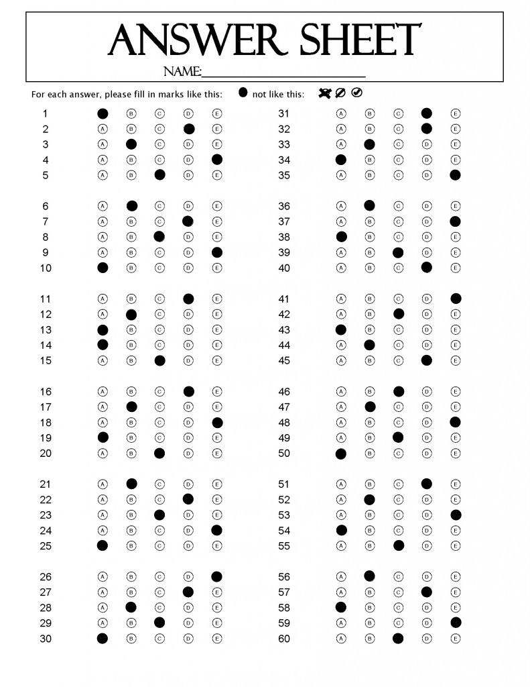

# Project to check multiple choice test with opencv and python

In this project we used four library, including opencv, numpy, regex and pandas to analyze the photos ( the students' anwser) to find the right anwser, wrong anwser and the students' result.

## Install library:

Opencv:
   
       pip install opencv-python
       conda install opencv (if you use conda)
       
Numpy:
 
        pip install numpy
        conda install numpy (if you use conda)
        
Pandas:
        
        pip install pandas
        conda install pandas (if you use conda)
        
Regex:
   
        pip install regex
        conda install regex (if you use conda)
        

      

## Data:

In this project, we used 50 photos-this is the student result in the answer sheet. You can find it in folder "Student".

Example data:

 

With these datas, we compares the students' answers with the our answer to find the students' result. Our anwser in folder "answer".

       

# Language and technology: 

- [x] Python
- [x] Visual studio
- [x] Github

